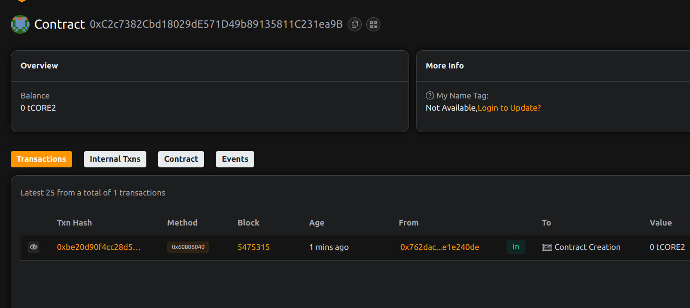

# TimeVesting: Token Vesting Mechanism Based on Time and Contribution

## Project Description
TimeVesting is a sophisticated smart contract solution designed to manage token vesting schedules based on both time and contribution metrics. This mechanism ensures fair and transparent distribution of tokens to team members, investors, and contributors according to predefined vesting rules that account for both the passage of time and individual contribution levels.

## Project Vision
Our vision is to create a robust, flexible vesting solution that can be adapted to various token distribution scenarios while maintaining security and transparency. The TimeVesting contract aims to become a standard for projects that want to align long-term incentives between stakeholders by combining time-based vesting with contribution-based rewards.

## Key Features
- Customizable vesting schedules combining time and contribution factors
- Multiple vesting schedules per beneficiary
- Real-time calculation of releasable tokens
- Secure token handling with ERC20 compatibility
- Transparent tracking of all vesting schedules
- Owner-controlled vesting schedule creation

## Future Scope
- Integration with DAO governance for schedule approvals
- Dynamic contribution score adjustments
- Multi-signature support for critical operations
- Vesting schedule templates for common use cases
- Cross-chain vesting capabilities
- Analytics dashboard for tracking vesting progress

## Contract Details
0xC2c7382Cbd18029dE571D49b89135811C231ea9B

